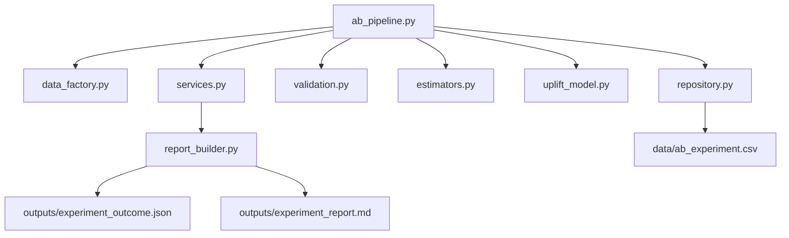

# AB_Testing - Real-World ML Experimentation Platform

ES: Proyecto profesional de A/B Testing con Machine Learning aplicado a un caso real de optimizacion de checkout en ecommerce.

EN: Professional A/B Testing project with Machine Learning for a real-world ecommerce checkout optimization case.

## Business Case / Caso de Negocio

- ES: Una empresa ecommerce quiere validar un nuevo flujo de checkout para aumentar conversion y revenue sin afectar calidad de trafico.
- EN: An ecommerce company wants to validate a new checkout flow to increase conversion and revenue without harming traffic quality.

## Architecture / Arquitectura



## Engineering Patterns / Patrones de Ingenieria

- Repository Pattern: `CsvExperimentRepository` desacopla persistencia de la logica de negocio.
- Strategy Pattern: estimadores intercambiables para conversion y revenue.
- Factory Pattern: `EstimatorFactory` centraliza creacion de estrategias por metrica.
- Service Layer: `ExperimentAnalysisService` orquesta el flujo de extremo a extremo.
- Decision Engine: encapsula reglas de rollout productivo.

## Folder Structure / Estructura

```text
AB_Testing/
  ab_pipeline.py
  app_ab.py
  requirements.txt
  data/
  outputs/
  src/ab_testing/
    application/
    data/
    domain/
    infrastructure/
    ml/
    reporting/
    stats/
  tests/
```

## Run Pipeline / Ejecutar Pipeline

```powershell
python .\AB_Testing\ab_pipeline.py
```

Con parametros:

```powershell
python .\AB_Testing\ab_pipeline.py --sample-size 20000 --alpha 0.05 --seed 77
```

## Run Dashboard / Ejecutar Dashboard

```powershell
python -m streamlit run .\AB_Testing\app_ab.py --server.port 8519
```

## Test Suite / Pruebas

```powershell
python -m pytest .\AB_Testing\tests
```

## Main Outputs / Salidas Principales

- `AB_Testing/data/ab_experiment.csv`
- `AB_Testing/outputs/experiment_outcome.json`
- `AB_Testing/outputs/experiment_report.md`
- `AB_Testing/outputs/variant_summary.csv`

## Real-World Value / Valor en Vida Real

- Reduce risk before rollout with statistical guardrails.
- Combines classic experimentation and ML uplift segmentation.
- Produces decision-ready artifacts for product and growth teams.
