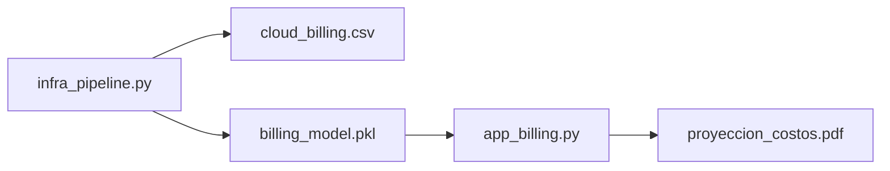

# Linear_Regression - Cloud Cost Forecasting / Prediccion de Costos Cloud


ES: Modulo orientado a control financiero de infraestructura cloud mediante regresion lineal y reporte descargable.

EN: Module focused on cloud financial control through linear regression and downloadable reporting.

## Business Objective / Objetivo de Negocio

- ES: Estimar costo mensual de infraestructura para planificacion presupuestaria.
- EN: Estimate monthly infrastructure cost for budget planning.

## Delivery Flow / Flujo de Entrega



## Technical Components / Componentes Tecnicos

| File | Role |
| --- | --- |
| `infra_pipeline.py` | synthetic data generation, training, and model evaluation |
| `app_billing.py` | Streamlit interface for interactive forecasting |
| `billing_report.py` | PDF export for management-ready output |

## Run Demo / Demo de Ejecucion

```powershell
python .\Linear_Regression\infra_pipeline.py
python -m streamlit run .\Linear_Regression\app_billing.py --server.port 8517
```

## Portfolio Value / Valor para Portfolio

- ES: Conecta modelo predictivo con entrega ejecutiva (PDF) y UI de negocio.
- EN: Connects predictive modeling with executive delivery (PDF) and business UI.

## Related Links / Enlaces Relacionados

- [../README.md](../README.md)
- [../docs/WORKFLOWS.md](../docs/WORKFLOWS.md)
- [../docs/TROUBLESHOOTING.md](../docs/TROUBLESHOOTING.md)
