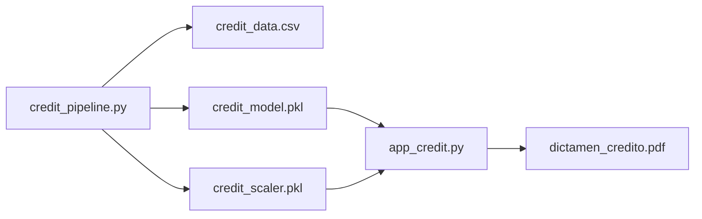

# Logistic_regression - Credit Risk Scoring / Evaluacion de Riesgo Crediticio


ES: Modulo orientado a la evaluacion de solicitudes de credito mediante regresion logistica, con dictamen oficial descargable.

EN: Module focused on credit application evaluation through logistic regression, with a downloadable official ruling.

## Business Objective / Objetivo de Negocio

- ES: Clasificar solicitudes de credito como APROBADO o RECHAZADO basandose en perfil financiero del solicitante.
- EN: Classify credit applications as APPROVED or REJECTED based on the applicant's financial profile.

## Delivery Flow / Flujo de Entrega



## Technical Components / Componentes Tecnicos

| File | Role |
| --- | --- |
| `credit_pipeline.py` | synthetic data generation, scaling, training, and artifact persistence |
| `app_credit.py` | Streamlit interface for interactive credit evaluation |
| `credit_report.py` | PDF export for official credit ruling output |

## Input Features / Variables de Entrada

| Feature / Variable | Description / Descripcion |
| --- | --- |
| `ingresos_anuales` | Annual income of the applicant |
| `edad` | Applicant age |
| `puntaje_buro` | Credit bureau score (300-850) |
| `deuda_actual` | Current outstanding debt |
| `historial_atrasos` | Number of months with payment delays |

## Run Demo / Demo de Ejecucion

```powershell
python .\Logistic_regression\credit_pipeline.py
python -m streamlit run .\Logistic_regression\app_credit.py --server.port 8518
```

## Portfolio Value / Valor para Portfolio

- ES: Demuestra clasificacion binaria aplicada a decision de negocio real con salida ejecutiva (PDF).
- EN: Demonstrates binary classification applied to a real business decision with executive output (PDF).

## Related Links / Enlaces Relacionados

- [../README.md](../README.md)
- [../docs/WORKFLOWS.md](../docs/WORKFLOWS.md)
- [../docs/TROUBLESHOOTING.md](../docs/TROUBLESHOOTING.md)
