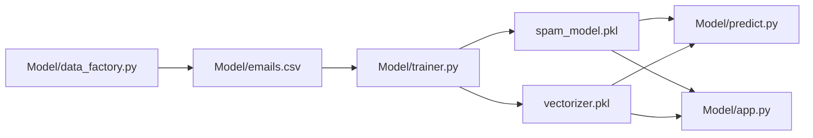

# Naive_Bayes - Email Risk Classification / Clasificacion de Riesgo de Correo


ES: Solucion de clasificacion spam/ham con pipeline reproducible, inferencia por consola y app web interactiva.

EN: Spam/ham classification solution with reproducible pipeline, CLI inference, and interactive web app.

## Business Objective / Objetivo de Negocio

- ES: Filtrar riesgo en comunicaciones para reducir ruido y potencial fraude.
- EN: Filter communication risk to reduce noise and potential fraud.

## Delivery Flow / Flujo de Entrega



## Technical Components / Componentes Tecnicos

| Script | Role |
| --- | --- |
| `Model/data_factory.py` | synthetic data generation |
| `Model/trainer.py` | text preprocessing, vectorization, training, evaluation |
| `Model/predict.py` | CLI inference |
| `Model/app.py` | Streamlit interface |
| `Model/visualizer.py` | word-frequency diagnostics |

## Run Demo / Demo de Ejecucion

```powershell
python .\Naive_Bayes\Model\trainer.py
python .\Naive_Bayes\Model\predict.py
python -m streamlit run .\Naive_Bayes\Model\app.py --server.port 8516
```

## Portfolio Value / Valor para Portfolio

- ES: Demuestra NLP clasico con despliegue rapido y consumible por usuarios no tecnicos.
- EN: Demonstrates classical NLP with fast deployment and non-technical usability.

## Related Links / Enlaces Relacionados

- [../README.md](../README.md)
- [../docs/API_REFERENCE.md](../docs/API_REFERENCE.md)
