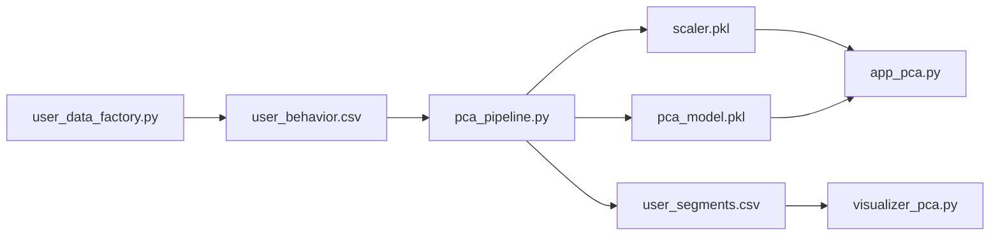

# PCA - User Segmentation Projection / Proyeccion para Segmentacion de Usuarios


ES: Modulo para resumir 10 variables de comportamiento en 2 componentes principales, facilitando segmentacion y priorizacion de estrategias.

EN: Module that compresses 10 behavior variables into 2 principal components to enable segmentation and strategy prioritization.

## Business Objective / Objetivo de Negocio

- ES: Identificar patrones de comportamiento para acciones de marketing o producto.
- EN: Identify behavior patterns for marketing or product actions.

## Delivery Flow / Flujo de Entrega



## Technical Components / Componentes Tecnicos

| File | Role |
| --- | --- |
| `user_data_factory.py` | synthetic behavior data generation |
| `pca_pipeline.py` | scaling, PCA training, and artifact persistence |
| `app_pca.py` | interactive projection app |
| `visualizer_pca.py` | PCA space visualization |

## Run Demo / Demo de Ejecucion

```powershell
python .\PCA\user_data_factory.py
python .\PCA\pca_pipeline.py
python .\PCA\visualizer_pca.py
python -m streamlit run .\PCA\app_pca.py --server.port 8515
```

## Portfolio Value / Valor para Portfolio

- ES: Muestra competencia en reduccion de dimensionalidad y explicacion de insights.
- EN: Shows competence in dimensionality reduction and insight communication.

## Related Links / Enlaces Relacionados

- [../README.md](../README.md)
- [../docs/WORKFLOWS.md](../docs/WORKFLOWS.md)
