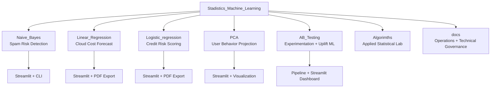

# Stadistics_Machine_Learning


[](https://www.python.org/)
[](https://streamlit.io/)
[](https://scikit-learn.org/)
[](#)

## Executive Summary / Resumen Ejecutivo

ES: Repositorio de portfolio orientado a negocio que demuestra cinco lineas completas de trabajo: clasificacion de texto (Naive Bayes), prediccion de costos cloud (Linear Regression), evaluacion de riesgo crediticio (Logistic Regression), reduccion de dimensionalidad para segmentacion de usuarios (PCA) y experimentacion A/B Testing con ML para decisiones de producto, ademas de un laboratorio de notebooks para analisis estadistico aplicado.

EN: Business-oriented portfolio repository showcasing five end-to-end tracks: text classification (Naive Bayes), cloud cost forecasting (Linear Regression), credit risk scoring (Logistic Regression), user behavior dimensionality reduction (PCA), and ML-powered A/B testing experimentation for product decisions, plus a notebook lab for applied statistical analysis.

## Why This Portfolio Matters / Por Que Este Portfolio Importa

| Capability | Evidence in this repository |
| --- | --- |
| End-to-end ML delivery | Data generation -> training -> evaluation -> serialized artifacts -> interactive apps |
| Product mindset | Streamlit applications designed for decision support and quick adoption |
| Applied analytics | Practical use of Bayesian methods, Monte Carlo simulation, and multivariate analysis |
| Engineering discipline | Modular folder structure, workflow docs, troubleshooting guide, API-style references |

## Business-Aligned Architecture / Arquitectura Orientada a Negocio



## Project Modules / Modulos del Proyecto

| Folder | Business Objective | Key Deliverables | Guide |
| --- | --- | --- | --- |
| `Naive_Bayes/` | Detect spam risk in email content | Trained model, vectorizer, CLI inference, Streamlit app | [Naive_Bayes/README.md](Naive_Bayes/README.md) |
| `Linear_Regression/` | Estimate monthly cloud infrastructure cost | Forecast model, cost simulator app, PDF report output | [Linear_Regression/README.md](Linear_Regression/README.md) |
| `Logistic_regression/` | Evaluate credit applications and score default risk | Logistic model, scaler, credit scoring app, PDF ruling | [Logistic_regression/README.md](Logistic_regression/README.md) |
| `PCA/` | Compress user behavior data for segmentation | Scaler, PCA model, projected user map, app projection | [PCA/README.md](PCA/README.md) |
| `AB_Testing/` | Validate product changes with statistical and ML experimentation | Experiment pipeline, CUPED metrics, uplift targeting, decision reports, Streamlit command center | [AB_Testing/README.md](AB_Testing/README.md) |
| `Algorimths/` | Explore statistical and ML foundations | Bayesian inference, optimization, simulation notebooks | [Algorimths/README.md](Algorimths/README.md) |
| `docs/` | Standardize operation and maintenance | Setup, workflows, API reference, troubleshooting | [docs/INDEX.md](docs/INDEX.md) |

## Demonstration Paths / Rutas de Demostracion

### 1) Spam/Ham Classification Demo

```powershell
python .\Naive_Bayes\Model\trainer.py
python .\Naive_Bayes\Model\predict.py
python -m streamlit run .\Naive_Bayes\Model\app.py --server.port 8516
```

### 2) Cloud Billing Forecast Demo

```powershell
python .\Linear_Regression\infra_pipeline.py
python -m streamlit run .\Linear_Regression\app_billing.py --server.port 8517
```

### 3) Credit Risk Scoring Demo

```powershell
python .\Logistic_regression\credit_pipeline.py
python -m streamlit run .\Logistic_regression\app_credit.py --server.port 8518
```

### 4) User Segmentation with PCA Demo

```powershell
python .\PCA\user_data_factory.py
python .\PCA\pca_pipeline.py
python .\PCA\visualizer_pca.py
python -m streamlit run .\PCA\app_pca.py --server.port 8515
```

### 5) A/B Testing ML Experimentation Demo

```powershell
python .\AB_Testing\ab_pipeline.py
python -m streamlit run .\AB_Testing\app_ab.py --server.port 8519
```

## Recruiter Snapshot / Snapshot para Reclutadores

- ES: Implementacion de ciclos completos de machine learning con foco en uso real.
- EN: Full machine learning lifecycle implementation focused on real usage.
- ES: Capacidad de traducir modelos tecnicos a interfaces de negocio.
- EN: Ability to translate technical models into business-facing interfaces.
- ES: Documentacion operacional y tecnica lista para equipos colaborativos.
- EN: Operational and technical documentation ready for collaborative teams.

## LinkedIn-Ready Summary / Resumen Listo para LinkedIn

ES: Portfolio de Machine Learning aplicado con proyectos de clasificacion de spam, prediccion de costos cloud, evaluacion de riesgo crediticio con Regresion Logistica, segmentacion de usuarios con PCA y A/B Testing con ML para experimentacion de producto. Incluye pipelines reproducibles, despliegue en Streamlit y documentacion operativa para ejecucion y mantenimiento.

EN: Applied Machine Learning portfolio featuring spam classification, cloud cost forecasting, credit risk scoring with Logistic Regression, PCA-based user segmentation, and ML-powered A/B testing for product experimentation. Includes reproducible pipelines, Streamlit deployment, and operational documentation for execution and maintenance.

## Documentation Map / Mapa de Documentacion

- [docs/INDEX.md](docs/INDEX.md)
- [docs/SETUP_AND_ENV.md](docs/SETUP_AND_ENV.md)
- [docs/WORKFLOWS.md](docs/WORKFLOWS.md)
- [docs/API_REFERENCE.md](docs/API_REFERENCE.md)
- [docs/TROUBLESHOOTING.md](docs/TROUBLESHOOTING.md)
