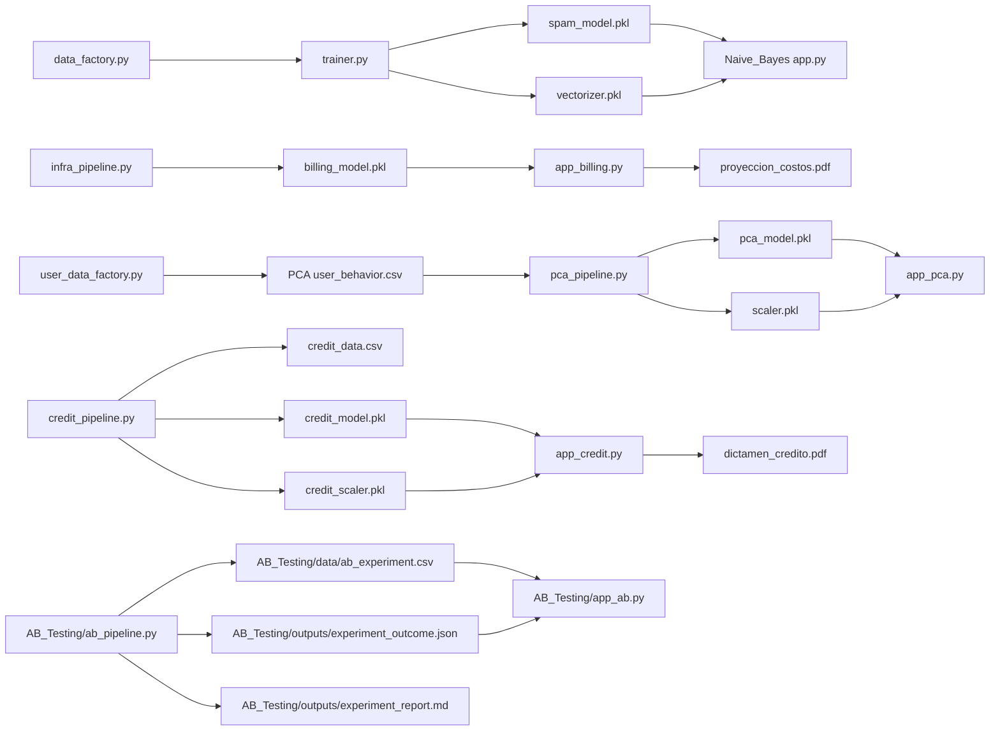

# API Reference / Referencia de API

ES: Contratos tecnicos de scripts, datos y artefactos.  
EN: Technical contracts for scripts, data, and artifacts.

## 1) Naive_Bayes Module / Modulo Naive_Bayes

### `Naive_Bayes/Model/data_factory.py`

| Field / Campo | Value / Valor |
| --- | --- |
| Main function / Funcion principal | `generate_dataset(n_samples=1000)` |
| Input / Entrada | `n_samples` (`int`) |
| Output / Salida | `Naive_Bayes/Model/emails.csv` |
| CSV schema / Esquema CSV | `text` (`str`), `label` (`0 ham / 1 spam`) |

### `Naive_Bayes/Model/trainer.py`

| Field / Campo | Value / Valor |
| --- | --- |
| Functions / Funciones | `clean_text(text)`, `train_model()` |
| Pipeline | regex cleaning, 80/20 split, TF-IDF, `MultinomialNB` |
| Artifacts / Artefactos | `spam_model.pkl`, `vectorizer.pkl` |
| Metrics / Metricas | `classification_report` |

### `Naive_Bayes/Model/predict.py`

| Field / Campo | Value / Valor |
| --- | --- |
| Function / Funcion | `classify_email(email_text)` |
| Runtime dependencies / Dependencias runtime | `spam_model.pkl`, `vectorizer.pkl` |
| Output / Salida | label + confidence in console |

### `Naive_Bayes/Model/app.py`

| Field / Campo | Value / Valor |
| --- | --- |
| Framework | Streamlit |
| Model loading / Carga de modelo | `@st.cache_resource` |
| Input / Entrada | email text |
| Output / Salida | SPAM/HAM + confidence metric |

## 2) Linear_Regression Module / Modulo Linear_Regression

### `Linear_Regression/infra_pipeline.py`

| Field / Campo | Value / Valor |
| --- | --- |
| Main function / Funcion principal | `setup_infra_project()` |
| Generated dataset / Dataset generado | `cloud_billing.csv` |
| Features | `usuarios`, `almacenamiento`, `cpu_horas`, `api_calls` |
| Target | `costo_total` |
| Model / Modelo | `LinearRegression` |
| Metrics / Metricas | `R2`, `MAE` |
| Artifact / Artefacto | `billing_model.pkl` |

### `Linear_Regression/app_billing.py`

| Field / Campo | Value / Valor |
| --- | --- |
| Framework | Streamlit |
| Requirement / Requisito | `billing_model.pkl` |
| Flow / Flujo | inputs -> prediction -> PDF download |
| Explainability / Explicabilidad | coefficient bar chart |
| Safe failure / Falla controlada | `st.stop()` if model missing |

### `Linear_Regression/billing_report.py`

| Field / Campo | Value / Valor |
| --- | --- |
| Class / Clase | `BillingReport(FPDF)` |
| Function / Funcion | `generate_billing_pdf(inputs, prediction)` |
| Output / Salida | `proyeccion_costos.pdf` |

## 3) PCA Module / Modulo PCA

### `PCA/user_data_factory.py`

| Field / Campo | Value / Valor |
| --- | --- |
| Main function / Funcion principal | `generate_user_data(n_users=1000)` |
| Generated dataset / Dataset generado | `PCA/user_behavior.csv` |
| Variables | 10 user behavior metrics |

### `PCA/pca_pipeline.py`

| Field / Campo | Value / Valor |
| --- | --- |
| Main function / Funcion principal | `run_pca_pipeline()` |
| Process / Proceso | load -> scale (`StandardScaler`) -> PCA(2) |
| Outputs / Salidas | `PCA/scaler.pkl`, `PCA/pca_model.pkl`, `PCA/user_segments.csv` |
| Console output / Salida en consola | explained variance |

### `PCA/app_pca.py`

| Field / Campo | Value / Valor |
| --- | --- |
| Framework | Streamlit |
| Required models / Modelos requeridos | `scaler.pkl`, `pca_model.pkl` |
| Input / Entrada | 10 user metrics |
| Output / Salida | projected coordinates `PC1`, `PC2` |

### `PCA/visualizer_pca.py`

| Field / Campo | Value / Valor |
| --- | --- |
| Main function / Funcion principal | `visualize_clusters()` |
| Input / Entrada | `PCA/user_segments.csv` |
| Output / Salida | PC1 vs PC2 scatter plot |

## Dependency Graph / Grafo de Dependencias

## 4) Logistic_regression Module / Modulo Logistic_regression

### `Logistic_regression/credit_pipeline.py`

| Field / Campo | Value / Valor |
| --- | --- |
| Main function / Funcion principal | `setup_credit_project()` |
| Generated dataset / Dataset generado | `credit_data.csv` |
| Features | `ingresos_anuales`, `edad`, `puntaje_buro`, `deuda_actual`, `historial_atrasos` |
| Target | `riesgo` (`0 aprobado / 1 rechazado`) |
| Preprocessing / Preprocesamiento | `StandardScaler` |
| Model / Modelo | `LogisticRegression` |
| Metrics / Metricas | `classification_report`, `confusion_matrix` |
| Artifacts / Artefactos | `credit_model.pkl`, `credit_scaler.pkl` |

### `Logistic_regression/app_credit.py`

| Field / Campo | Value / Valor |
| --- | --- |
| Framework | Streamlit |
| Requirement / Requisito | `credit_model.pkl`, `credit_scaler.pkl` |
| Flow / Flujo | inputs -> scale -> predict_proba -> decision -> PDF download |
| Decision logic / Logica de decision | `prediction == 1` -> RECHAZADO, `prediction == 0` -> APROBADO |
| Safe failure / Falla controlada | `st.stop()` if models missing |

### `Logistic_regression/credit_report.py`

| Field / Campo | Value / Valor |
| --- | --- |
| Class / Clase | `CreditReport(FPDF)` |
| Function / Funcion | `generate_credit_pdf(inputs, result, probability)` |
| Output / Salida | `dictamen_credito.pdf` |

## 5) AB_Testing Module / Modulo AB_Testing

### `AB_Testing/ab_pipeline.py`

| Field / Campo | Value / Valor |
| --- | --- |
| Main function / Funcion principal | `main()` |
| Inputs / Entradas | CLI args: `sample_size`, `alpha`, `mde`, `seed`, `treatment_share` |
| Process / Proceso | data generation -> validation -> treatment effect estimation -> uplift modeling -> reporting |
| Outputs / Salidas | `AB_Testing/data/ab_experiment.csv`, `AB_Testing/outputs/experiment_outcome.json`, `AB_Testing/outputs/experiment_report.md`, `AB_Testing/outputs/variant_summary.csv` |
| Architecture role / Rol de arquitectura | Application entrypoint and orchestration bootstrap |

### `AB_Testing/src/ab_testing/application/services.py`

| Field / Campo | Value / Valor |
| --- | --- |
| Key classes / Clases clave | `ExperimentAnalysisService`, `DecisionEngine` |
| Responsibilities / Responsabilidades | execute workflow, apply guardrails, and produce business decision |
| Patterns / Patrones | Service Layer, Decision Policy |

### `AB_Testing/src/ab_testing/stats/estimators.py`

| Field / Campo | Value / Valor |
| --- | --- |
| Key classes / Clases clave | `DifferenceInMeansEstimator`, `CupedDifferenceInMeansEstimator` |
| Metrics / Metricas | conversion rate uplift, revenue per user CUPED uplift |
| Patterns / Patrones | Strategy Pattern (estimator strategy per metric) |

### `AB_Testing/src/ab_testing/data/repository.py`

| Field / Campo | Value / Valor |
| --- | --- |
| Key class / Clase clave | `CsvExperimentRepository` |
| Responsibility / Responsabilidad | persistence abstraction for experiment dataset |
| Pattern / Patron | Repository Pattern |

### `AB_Testing/src/ab_testing/infrastructure/estimator_factory.py`

| Field / Campo | Value / Valor |
| --- | --- |
| Key class / Clase clave | `EstimatorFactory` |
| Responsibility / Responsabilidad | central creation of estimator strategy by metric |
| Pattern / Patron | Factory Pattern |

### `AB_Testing/app_ab.py`

| Field / Campo | Value / Valor |
| --- | --- |
| Framework | Streamlit |
| Input source / Fuente de entrada | `experiment_outcome.json` + experiment CSV |
| Output / Salida | command center with decision, metrics, variant charts, uplift deciles |
