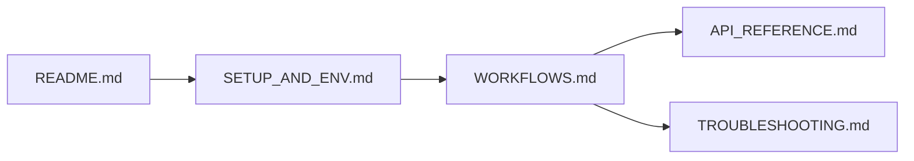

# Documentation Hub / Centro de Documentacion

ES: Esta carpeta centraliza la documentacion operativa y tecnica.  
EN: This folder centralizes operational and technical documentation.

## Reading Map / Mapa de Lectura

## Core Documents / Documentos Base

| File / Archivo | ES | EN |
| --- | --- | --- |
| [../README.md](../README.md) | Vista global del proyecto | Project-wide overview |
| [SETUP_AND_ENV.md](SETUP_AND_ENV.md) | Preparacion del entorno | Environment setup |
| [WORKFLOWS.md](WORKFLOWS.md) | Flujos por objetivo | Goal-oriented workflows |
| [API_REFERENCE.md](API_REFERENCE.md) | Contratos tecnicos | Technical contracts |
| [TROUBLESHOOTING.md](TROUBLESHOOTING.md) | Fallos comunes y soluciones | Common issues and fixes |

## Secondary Folder Guides / Guias Secundarias por Carpeta

| Folder / Carpeta | Guide / Guia |
| --- | --- |
| Algorimths | [../Algorimths/README.md](../Algorimths/README.md) |
| AB_Testing | [../AB_Testing/README.md](../AB_Testing/README.md) |
| Linear_Regression | [../Linear_Regression/README.md](../Linear_Regression/README.md) |
| Logistic_regression | [../Logistic_regression/README.md](../Logistic_regression/README.md) |
| Naive_Bayes | [../Naive_Bayes/README.md](../Naive_Bayes/README.md) |
| PCA | [../PCA/README.md](../PCA/README.md) |

## Conventions / Convenciones

- ES: Comandos orientados a Windows PowerShell.  
  EN: Commands are tailored for Windows PowerShell.
- ES: Rutas relativas desde la raiz del repo.  
  EN: Paths are relative to repo root.
- ES: Se respetan nombres reales existentes (`Algorimths`, `requeriments.txt`).  
  EN: Existing real names are intentionally preserved.

## Maintenance Checklist / Checklist de Mantenimiento

- [ ] Update this hub when folder structure changes.
- [ ] Sync [API_REFERENCE.md](API_REFERENCE.md) after script changes.
- [ ] Add repeated production issues to [TROUBLESHOOTING.md](TROUBLESHOOTING.md).
