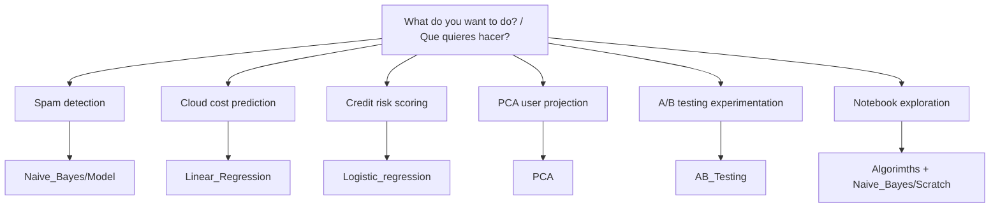

# Operational Workflows / Flujos Operativos


ES: Ejecuta segun objetivo, no por archivo suelto.  
EN: Execute by objective, not by isolated files.

## Decision Tree / Arbol de Decision



## Workflow 0: Base Preparation / Preparacion Base

```powershell
& .\.venv\Scripts\Activate.ps1
```

## Workflow 1: Naive Bayes End-to-End

```powershell
python .\Naive_Bayes\Model\trainer.py
python .\Naive_Bayes\Model\predict.py
python -m streamlit run .\Naive_Bayes\Model\app.py --server.port 8516
```

Expected / Esperado:

- metrics in console / metricas en consola
- `spam_model.pkl` and `vectorizer.pkl`
- running Streamlit app / app Streamlit activa

## Workflow 2: Linear Regression Cloud Billing

```powershell
python .\Linear_Regression\infra_pipeline.py
python -m streamlit run .\Linear_Regression\app_billing.py --server.port 8517
```

Expected / Esperado:

- `cloud_billing.csv` updated
- `billing_model.pkl` generated
- PDF export from app

## Workflow 3: PCA User Behavior

```powershell
python .\PCA\user_data_factory.py
python .\PCA\pca_pipeline.py
python .\PCA\visualizer_pca.py
python -m streamlit run .\PCA\app_pca.py --server.port 8515
```

Expected / Esperado:

- `PCA/scaler.pkl`, `PCA/pca_model.pkl`, `PCA/user_segments.csv`
- scatter plot and projected coordinates

## Workflow 4: Logistic Regression Credit Scoring

```powershell
python .\Logistic_regression\credit_pipeline.py
python -m streamlit run .\Logistic_regression\app_credit.py --server.port 8518
```

Expected / Esperado:

- `credit_data.csv` generated
- `credit_model.pkl` and `credit_scaler.pkl` saved
- Streamlit credit evaluation app with PDF ruling download

## Workflow 5: A/B Testing ML Experimentation

```powershell
python .\AB_Testing\ab_pipeline.py
python -m streamlit run .\AB_Testing\app_ab.py --server.port 8519
```

Expected / Esperado:

- `AB_Testing/data/ab_experiment.csv` generated
- `AB_Testing/outputs/experiment_outcome.json` and `experiment_report.md` generated
- Streamlit command center with decision, significance, and uplift deciles

## Workflow 6: Notebook Learning Path / Ruta de Aprendizaje

1. `Algorimths/Bayesian_inference_engine.ipynb`
2. `Algorimths/Digital_sensor.ipynb`
3. `Algorimths/Dinamic_campaign_optimizer.ipynb`
4. `Algorimths/Optimizer_Inventory.ipynb`
5. `Algorimths/Simulator_physical_perfomance.ipynb`
6. `Algorimths/Multivariate_Analysis.ipynb`
7. `Algorimths/Naive_Bayes_Multinomial.ipynb`
8. `Naive_Bayes/Scratch/Naive_Bayes.ipynb`

## Workflow 7: Publish Docs / Publicar Documentacion

```powershell
git status
git add README.md docs/ AB_Testing/README.md Algorimths/README.md Linear_Regression/README.md Logistic_regression/README.md Naive_Bayes/README.md PCA/README.md
git commit -m "docs: add bilingual ES-EN docs"
git push
```
